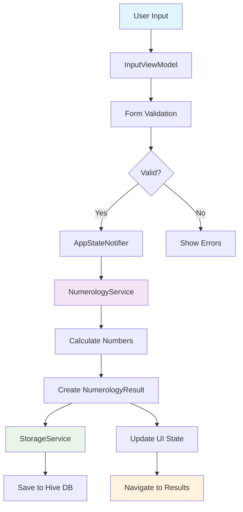
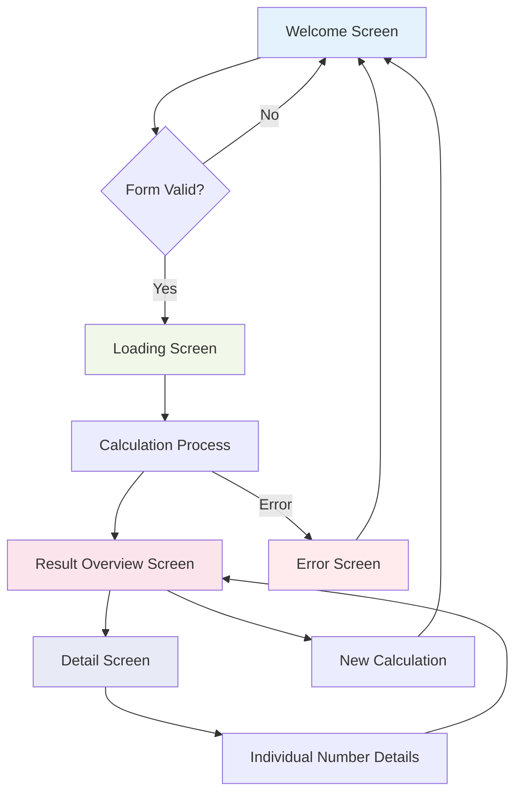

# Numero Uno - Numerology Calculator 🔮

A comprehensive Flutter application that calculates and analyzes numerological values based on user's personal information. Discover the mystical power of numbers and unlock insights about your personality, life path, and destiny through ancient numerology wisdom.

## 📱 App Overview

**Numero Uno** is a modern, beautifully designed numerology calculator that provides users with detailed insights into their personal numerological profile. The app calculates five core numerological numbers and presents them with detailed interpretations and meanings.

### ✨ Key Features

- **Life Path Number**: Reveals your life's purpose and the path you're meant to walk
- **Birthday Number**: Represents your natural talents and abilities
- **Expression Number**: Shows your life's goal and what you're meant to accomplish
- **Soul Urge Number**: Represents your inner desires and what motivates you
- **Personality Number**: Shows how others perceive you and your outer personality
- **Local Storage**: Saves calculation history using Hive database
- **Responsive Design**: Optimized for mobile, tablet, and desktop platforms
- **Dark/Light Theme**: Complete theming support with smooth transitions
- **Smooth Animations**: Beautiful UI animations and transitions using Flutter Animate

## 🏗️ Architecture

The app follows **MVVM (Model-View-ViewModel)** architecture pattern with **Riverpod** for state management:

```text
lib/
├── config/          # App configuration (theme, routing)
├── models/          # Data models (Hive entities)
├── providers/       # Riverpod providers
├── services/        # Business logic services
├── viewmodels/      # State management logic
├── views/           # UI components
│   ├── screens/     # Screen widgets
│   └── widgets/     # Reusable UI components
└── utils/           # Utility functions
```

## 📊 Data Flow Diagram



## 🔄 UI Flow Diagram



## 🧮 Numerology Calculation Process

The app implements traditional numerology calculation methods:

### 1. Life Path Number
- **Input**: Full date of birth (DD/MM/YYYY)
- **Process**: Reduce day, month, and year to single digits, then sum and reduce again
- **Example**: 15/03/1990 → 6+3+9 = 18 → 1+8 = 9

### 2. Expression Number
- **Input**: Full name
- **Process**: Convert each letter to its numerological value (A=1, B=2... I=9, J=1...)
- **Sum**: All letter values and reduce to single digit

### 3. Soul Urge Number
- **Input**: Full name (vowels only)
- **Process**: Same as Expression but only counting vowels (A, E, I, O, U)

### 4. Personality Number
- **Input**: Full name (consonants only)
- **Process**: Same as Expression but only counting consonants

### 5. Birthday Number
- **Input**: Day of birth
- **Process**: Reduce day number to single digit

## 🛠️ Technical Stack

### Core Technologies
- **Flutter**: Cross-platform UI framework
- **Dart**: Programming language

### State Management
- **Riverpod**: Modern state management solution
- **Flutter Hooks**: Simplified widget state management

### Local Storage
- **Hive**: Fast, lightweight NoSQL database
- **Shared Preferences**: Simple key-value storage

### UI/UX Libraries
- **Google Fonts**: Custom typography
- **Flutter Animate**: Smooth animations and transitions
- **Responsive Utils**: Cross-platform responsive design

### Development Tools
- **Build Runner**: Code generation
- **Hive Generator**: Model generation
- **Equatable**: Value equality comparisons

## 📁 Key Components

### Models
- `NumerologyResult`: Core result data structure
- `UserData`: User input data model
- `AppState`: Application state management

### Services
- `NumerologyService`: Core calculation engine
- `StorageService`: Data persistence layer

### Providers
- `appStateProvider`: Global app state
- `inputFormProvider`: Form state management
- `themeProvider`: Theme switching

### Screens
- `WelcomeScreen`: Main input form
- `LoadingScreen`: Calculation progress
- `ResultOverviewScreen`: Results summary
- `DetailScreen`: Individual number details
- `ErrorScreen`: Error handling

## 🚀 Getting Started

### Prerequisites
- Flutter SDK (3.8.1 or higher)
- Dart SDK
- Android Studio / VS Code with Flutter extension

### Installation

1. **Clone the repository**
```bash
git clone <repository-url>
cd numero_uno
```

2. **Install dependencies**
```bash
flutter pub get
```

3. **Generate code**
```bash
flutter packages pub run build_runner build
```

4. **Run the app**
```bash
flutter run
```

### Building for Production

```bash
# Android
flutter build apk --release

# iOS
flutter build ios --release

# Web
flutter build web --release

# Desktop
flutter build windows --release
flutter build macos --release
flutter build linux --release
```

## 🎨 Theming

The app supports both light and dark themes with:
- Custom color schemes
- Gradient backgrounds
- Consistent typography using Google Fonts
- Smooth theme transitions
- Responsive spacing and sizing

## 📱 Platform Support

- ✅ Android
- ✅ iOS
- ✅ Web
- ✅ Windows
- ✅ macOS
- ✅ Linux

## 🧪 Testing

```bash
# Run unit tests
flutter test

# Run widget tests
flutter test test/widget_test.dart
```

## 📝 License

This project is licensed under the MIT License - see the [LICENSE](LICENSE) file for details.

## 🤝 Contributing

1. Fork the repository
2. Create your feature branch (`git checkout -b feature/amazing-feature`)
3. Commit your changes (`git commit -m 'Add some amazing feature'`)
4. Push to the branch (`git push origin feature/amazing-feature`)
5. Open a Pull Request

## 📧 Support

For support and questions, please open an issue in the GitHub repository.

---

*"Numbers are the highest degree of knowledge. It is knowledge itself." - Plato*
